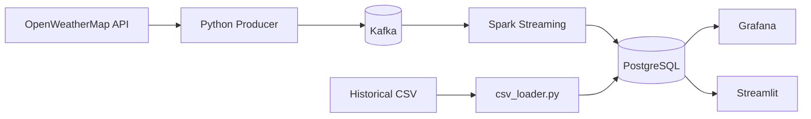

# İzmir Hava Kalitesi İzleme — YZM536

İzmir'deki hava kalitesi istasyonlarından gerçek zamanlı + tarihsel veri
toplayan uçtan uca veri boru hattı. Kafka → Spark Structured Streaming →
PostgreSQL → Grafana/Streamlit.

> **Ders:** YZM536 Data Engineering — Teslim: H8 %40 + H16 %60

## Mimari



Detaylar: [`docs/MIMARI.md`](docs/MIMARI.md) · 16 haftalık plan: [`docs/PROJE_PLANI.md`](docs/PROJE_PLANI.md)

## Hızlı Başlangıç (Local Dev)

```bash
# 1. Secrets (gitignored)
cp .envrc.example .envrc
cp .env.local.example .env.local   # gerçek değerleri gir
direnv allow

# 2. Python env
python -m venv .venv && source .venv/bin/activate
pip install -e ".[dev,ingestion,processing,streamlit,coolify]"
pre-commit install

# 3. Stack'i ayağa kaldır
make up
make logs     # servisleri izle
make ps       # durum

# 4. Test
make test
make lint
```

## Coolify Production Deploy

Hybrid mimarı: stateless servisler (PostgreSQL, Grafana, Streamlit, ingestion)
Coolify'a; stateful core (Kafka, Spark) local kalır.

```bash
# İlk kurulum: infra/coolify/README.md bak
make coolify-plan     # dry-run
make coolify-apply    # provisioning
make coolify-status   # sağlık
```

## Proje Yapısı

```
.claude/              Claude Code agents + slash commands + CLAUDE.md
docs/                 Mimari, proje planı, raporlar, varsayımlar
src/
  ingestion/          OpenWeatherMap collector, Kafka producer, CSV loader
  processing/         Spark batch + streaming + AQI calculator
  storage/            PostgreSQL schema, psycopg writer
  quality/            Data quality framework
  presentation/       Streamlit app (+ Grafana provisioning JSON)
  config/             pydantic-settings
tests/                pytest suites (markers: slow, integration, e2e)
infra/
  docker-compose.local.yml   Full dev stack
  docker-compose.coolify.yml Kafka subset (opsiyonel)
  Dockerfile.*               Multi-stage, non-root
  coolify/                   API IaC (client, provision, sync_secrets)
  postgres/init.sql          Role setup
```

## Geliştirme Ritüelleri

Claude Code slash komutları:
- `/sprint-start <N>` — Hafta N planı, agent ataması
- `/sprint-review` — Hafta kapanışı, quality gate
- `/agent-handoff <from> → <to>` — Multi-agent koordinasyon
- `/quality-gate` — Lint + test + secret scan
- `/coolify-provision plan|apply|status` — IaC
- `/coolify-sync-secrets push|pull|list` — Custom secret sync
- `/progress-report h8|h16` — Rapor draft

## Güvenlik

- Hiçbir secret repo'ya girmez. Bkz. `CLAUDE.md` → Secret Management Policy.
- `.env`, `.envrc` gitignored; `.env*.example` template'tir.
- Coolify secret'ları Magic Variables ile üretilir.
- `detect-secrets` pre-commit hook ile yanlışlıkla commit engellenir.

## Lisans

MIT.
