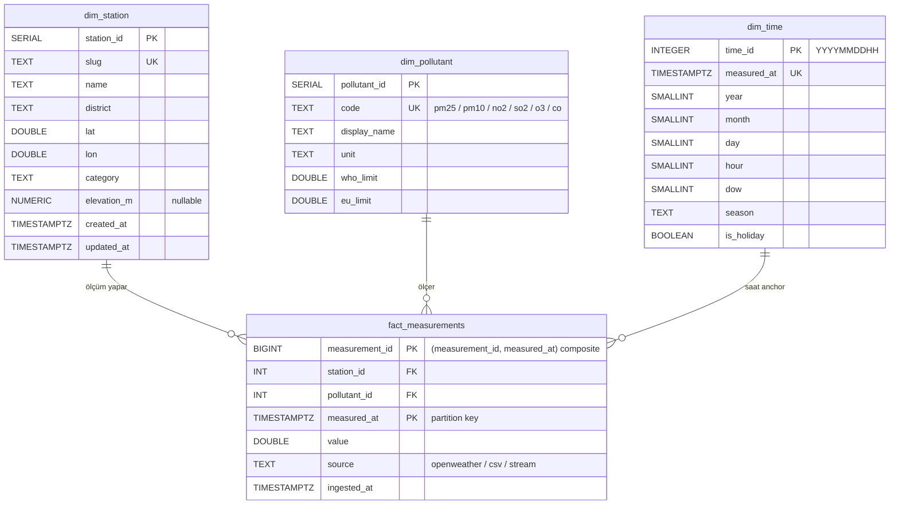

# Mimari Dokümanı

## Genel Bakış

Bu platform dört ana katmandan oluşur. Her katman bağımsız olarak ölçeklenebilir
ve Docker container'ları içinde çalışır.

## Katman 1: Veri Toplama (Ingestion)

**Bileşenler:** `api_collector.py`, `kafka_producer.py`, `csv_loader.py`

Veri iki kanaldan akar:
- **Streaming kanal:** OpenWeatherMap API → Python Producer → Kafka topic (`air-quality-raw`)
- **Batch kanal:** Tarihsel CSV dosyaları → Pandas temizleme → PostgreSQL doğrudan yükleme

API çağrısı her 60 dakikada bir yapılır (APScheduler ile). Her çağrı İzmir'deki
tanımlı istasyonlar için PM2.5, PM10, NO₂, SO₂, O₃ ve CO değerlerini çeker.

**Neden Kafka?** API'den gelen veri doğrudan veritabanına yazılabilirdi, ancak Kafka
kullanmak şu avantajları sağlar:
- Üretici (API collector) ve tüketici (Spark) birbirinden bağımsız çalışır
- Veri kaybı riski azalır (Kafka diske yazar)
- Birden fazla tüketici aynı veriyi okuyabilir (dashboard + batch + alert)

`csv_loader` Hafta 4'te idempotent hale getirildi: aynı CSV iki kez yüklenirse
`fact_measurements_unique_reading` UNIQUE constraint'i `ON CONFLICT DO NOTHING`
ile devreye girer; ikinci yükleme `(0 inserted, N skipped)` döner. Slug-based
istasyon çözümlemesi (`--station-slug konak`) `dim_station.slug` lookup'ı ile
yapılır.

## Katman 2: Veri İşleme (Processing)

**Bileşenler:** `spark_batch.py`, `spark_streaming.py`, `aqi_calculator.py`

İki işleme modu:
- **Batch:** Tarihsel verinin günlük/haftalık/aylık agregasyonu, hareketli ortalama
- **Streaming:** Kafka'dan Spark Structured Streaming ile okuma, 1 saatlik tumbling
  window'da anlık AQI hesaplama

AQI hesaplama EPA standardını takip eder: her kirletici için breakpoint tablosuna
göre alt-indeks hesaplanır, genel AQI en yüksek alt-indeks değeridir.

## Katman 3: Depolama (Storage)

**Bileşen:** PostgreSQL 16 + Star Schema

Yıldız şeması seçildi çünkü:
- Analitik sorgular (aggregation, GROUP BY) için optimize
- Boyut tabloları küçük, fact tablosu büyük — bu duruma ideal
- OLAP tarzı sorgulamalara uygun

### Şema Diyagramı



### Tablolar

- **`dim_station`** — İzmir'deki 6 hava kalitesi istasyonu. Hafta 4'te
  `category`, `elevation_m`, `created_at`, `updated_at` kolonlarıyla genişletildi.
  `slug` UNIQUE; `seed_dim_station.py` `config/stations.yaml`'den UPSERT yapar.
- **`dim_pollutant`** — PM2.5, PM10, NO₂, SO₂, O₃, CO için 6 satırlık seed tablosu.
  WHO 2021 ve EU 2008/50/EC limitleri µg/m³ cinsinden tutulur.
- **`dim_time`** — Hafta 4'te eklendi. Saatlik granülerite, `time_id = YYYYMMDDHH`
  integer PK (örn. `2026042514`). 24 ay × 30 gün × 24 saat ≈ 17K satır kapasitesi.
  `is_holiday` flag'i Hafta 5'te TR resmi tatil API/listesinden doldurulacak.
- **`fact_measurements`** — Aylık RANGE partition'lı ana fact tablosu (aşağıda
  detayı). `(station_id, pollutant_id, measured_at, source)` UNIQUE constraint
  (`fact_measurements_unique_reading`) idempotent ingestion için zorunlu.
- **`data_quality_runs`** — Hafta 12 DQ framework için audit tablo.
  `BIGSERIAL run_id`, `JSONB payload`. Hafta 4'te yapısal olarak açıldı; suite'ler
  doldurmaya Hafta 12'de başlar.

### Partitioning Stratejisi

`fact_measurements` aylık RANGE partition'lı:
- 2024-01..2025-12 = **24 monthly partition** (her biri ayın ilkinden bir
  sonraki ayın ilkine [first..first) yarı-açık aralık)
- **`fact_measurements_default`** — range dışı satırlar için catch-all
  (Hafta 10 rolling cron alarmı bu tabloyu izleyecek)
- Partition key zorunluluğu nedeniyle PK `(measurement_id, measured_at)` composite
- `BIGSERIAL` yerine açık `SEQUENCE` + `DEFAULT nextval(...)` (PG 16
  partition + identity inheritance bug'ı için)
- `pg_partman` extension'ı **kullanılmadı** (B1 kararı: Coolify managed PG'de
  extension yetkisi belirsiz; manuel `CREATE TABLE … PARTITION OF` 16 hafta
  scope'unda yeterli — Hafta 10 TD candidate)

### Index Seti

| Index | Tip | Kolon | Kullanım |
|-------|-----|-------|----------|
| `fact_measurements_measured_at_brin` | BRIN | `measured_at` | Append-only zaman serisi range scan; B-tree'den ~12× küçük |
| `fact_measurements_station_time_idx` | B-tree | `(station_id, measured_at DESC)` | "Son 24 saat şu istasyon" hot path |
| `fact_measurements_pollutant_idx` | B-tree | `(pollutant_id)` | Kirletici-bazlı raporlar, view join'leri |
| `fact_measurements_unique_reading` | UNIQUE B-tree | `(station_id, pollutant_id, measured_at, source)` | İdempotency garantisi (`ON CONFLICT`) |

### View'lar

- **`v_hourly_aqi`** (MATERIALIZED) — Saatlik granülerite, `(station, pollutant,
  hour)` agregat. AQI kolonu şimdilik `NULL::NUMERIC` placeholder; Hafta 7'de
  Spark streaming sub-index hesabı doldurulacak. `CONCURRENTLY` refresh için
  composite UNIQUE INDEX (`ix_v_hourly_aqi_pk`) tanımlı.
- **`v_daily_trends`** (regular VIEW) — Günlük min/max/avg/count per
  station × pollutant. Materialize edilmedi çünkü 24 ay × 6 istasyon × 6
  pollutant ≈ 26K satır agregasyonu runtime'da kabul edilebilir; planner
  partition pruning yapabiliyor.

### Performans Karakteristikleri

312K satırlık (12 ay × 30 gün × 24 saat × 6 istasyon × 6 kirletici) sentetik
yük altında ölçülen davranış (testcontainers PG 16, NVMe SSD baseline):

| Metrik | Değer |
|--------|-------|
| Bulk yükleme süresi | **52.6 sn** (~5,916 satır/sn) |
| DoD bütçesi | 60 sn |
| BRIN index toplam boyut | **600 KiB** (24 partition leaf'i) |
| B-tree composite (`station_id, measured_at`) | **7.00 MiB** |
| BRIN/B-tree oranı | **1:11.7** — append-only timestamp için textbook win |
| Partition pruning (1 ay filtresi) | Tek leaf scan (`fact_measurements_2024_06`), 23 diğer partition planlanmaz |
| EXPLAIN execution time (25K satır agregat) | 2.7 ms |

Detaylı ölçümler ve EXPLAIN ANALYZE çıktıları için bkz.
`docs/sprints/sprint-04-perf.md`.

### Migration Yönetimi

Şema değişiklikleri `infra/migrations/run.py` ile uygulanır (psycopg +
`schema_migrations` version tablosu, dosya naming `NNNN_<slug>.sql`,
checksum guard). Zincir:

| Versiyon | Dosya | İçerik |
|----------|-------|--------|
| 0001 | `0001_baseline.sql` | H3 stub: 3 dimension + flat fact + 6 satır pollutant seed |
| 0002 | `0002_star_schema_expand.sql` | `dim_station` kolon ekle, `dim_time` yeni tablo, `fact_measurements_unique_reading` UNIQUE |
| 0003 | `0003_partition_and_indexes.sql` | Partition swap (24 monthly + default), BRIN + 2× B-tree |
| 0004 | `0004_views_and_audit.sql` | `v_hourly_aqi`, `v_daily_trends`, `data_quality_runs`, GRANT'ler |

Her migration'ın `*.down.sql` rollback dosyası mevcut. `make migrate`
idempotent: ikinci run'da "0 migrations applied" döner.

## Katman 4: Sunum (Presentation)

**Bileşenler:** Grafana, Streamlit

- **Grafana:** Operasyonel izleme. Anlık AQI, trend grafikleri, alarmlar.
  PostgreSQL'e doğrudan bağlanır. Refresh: 5 dakika.
- **Streamlit:** Analitik keşif. Tarihsel karşılaştırma, korelasyon analizi,
  rapor indirme. Kullanıcı etkileşimli arayüz.

## Veri Akış Diyagramı

```
OpenWeatherMap API ──→ Python Producer ──→ Kafka (air-quality-raw)
                                              │
                                              ├──→ Spark Streaming ──→ PostgreSQL (fact)
                                              │                            │
Tarihsel CSV ──→ Pandas Temizleme ────────────┘                           │
                                                                          ├──→ Grafana
                                                                          └──→ Streamlit
```

## Teknoloji Seçim Gerekçeleri

| Teknoloji | Alternatifler | Neden bu? |
|-----------|---------------|-----------|
| Kafka | RabbitMQ, Redis Streams | Yüksek throughput, replay yeteneği, partition |
| Spark | Flink, plain Python | Batch + streaming tek API, geniş ekosistem |
| PostgreSQL | ClickHouse, TimescaleDB | Basit kurulum, SQL bilgisi yeterli, Grafana desteği |
| Grafana | Metabase, Superset | Real-time refresh, alert desteği, Kafka/PG entegrasyonu |
| Streamlit | Dash, Flask | Hızlı prototipleme, Python-native, sıfır frontend |
| Docker Compose | Kubernetes | Bireysel proje ölçeğinde yeterli, düşük karmaşıklık |
| Manuel partition | pg_partman | Coolify managed PG extension yetkisi belirsiz; 24 ay scope'unda manuel DDL yeterli |
| psycopg migration runner | Alembic | Projede SQLAlchemy yok; Alembic ORM bagajı gereksiz |
