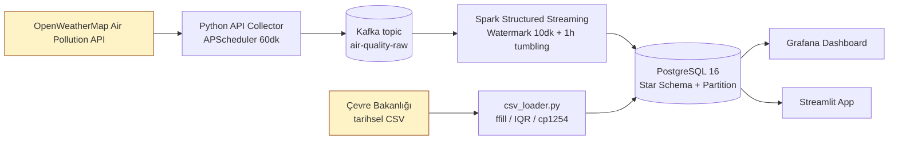
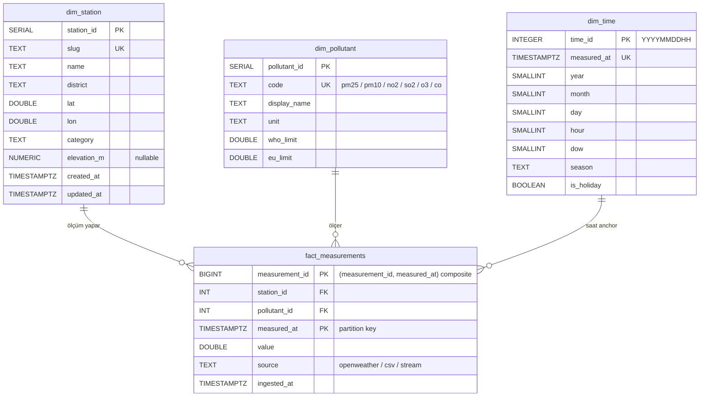

# YZM536 — Proje İlerleme Raporu (Hafta 8 / %40 Teslim)

**Proje Adı:** Gerçek Zamanlı Hava Kalitesi İzleme — Uçtan Uca Veri Boru Hattı
(İzmir Vakası)

**Öğrenci:** Emre Yılmaz — *(öğrenci numarası rapor teslim öncesi eklenecek)*

**Tarih:** 2026-04-28 (Hafta 4 kapanış — H8 ara teslim için draft;
teslim hedefi: 2026-05-25)

**Repo:** `https://github.com/emreylmaz/air-quality-izmir` (özel)

**Branch / HEAD:** `main` @ `26088f1` (Sprint 4 closeout)

---

## 1. Proje Tanımı ve Motivasyon

Bu çalışma, İzmir metropolüne ait altı istasyondan **gerçek zamanlı** ve
**tarihsel** hava kalitesi verilerini bir araya toplayan, modern bir veri
mühendisliği yığını üzerinde uçtan uca işleyen ve nihayetinde operatör
panellerine sunan bir veri boru hattı (data pipeline) tasarımını ele alır.
Proje, YZM536 *Veri Mühendisliği* dersinin 16 haftalık kapsamı içerisinde
yürütülmektedir; mevcut rapor, dersin Hafta 8 ara değerlendirme teslimi
(%40) için hazırlanmıştır.

### 1.1 Problem

Türkiye İstatistik Kurumu ve Çevre, Şehircilik ve İklim Değişikliği Bakanlığı
verilerine göre İzmir, **PM₂.₅** (parçacık çapı 2.5 µm altı toz) yıllık
ortalamalarında Dünya Sağlık Örgütü'nün 2021 güncellenmiş kılavuzunda
belirlediği **5 µg/m³** sınırını sürekli olarak aşmaktadır (DSÖ, 2021).
Avrupa Birliği'nin 2008/50/EC numaralı Hava Kalitesi Direktifi'nin koyduğu
**25 µg/m³** yıllık sınırın da bazı dönemlerde aşıldığı raporlanmıştır
(EEA, 2023). Üstelik İzmir'in topografik özellikleri (Körfez etrafında
toplanmış yerleşim, Aliağa endüstri bölgesi, sınırlı doğal hava
sirkülasyonu) hava kirliliğinin lokal pikler oluşturmasına neden olur.

Mevcut kamu portalları (T.C. Bakanlık SIM portalı, OpenWeatherMap public API)
saatlik veri yayınlasa da bu verinin **birleştirilmesi, temizlenmesi,
analitik depolama biçimine dönüştürülmesi ve tarihsel trend ile
karşılaştırılması** son kullanıcıya bırakılmıştır. Bu çalışma, söz konusu
işlemleri otomatize eden ve replikasyona uygun bir referans pipeline'ı
ortaya çıkarmayı hedefler.

### 1.2 Motivasyon

Akademik motivasyon, dersin kapsadığı dört temel konuyu (mesaj kuyruğu,
streaming işleme, ilişkisel veri ambarı modellemesi, görselleştirme)
gerçek bir kullanım senaryosu üzerinde uygulamaktır. Mühendislik
motivasyonu ise *operasyonel olarak ayağa kaldırılabilir*, *yeniden
çalıştırılabilir* (idempotent) ve *gözlemlenebilir* (observable) bir
sistem üretmektir. Bu nedenle proje hem yerel Docker Compose üzerinde
geliştiriciye tam stack sunar hem de **Coolify** üzerinde stateless
katmanlar için git-push deploy iş akışını işletir (hibrit dağıtım).

### 1.3 Katkılar

1. **Hibrit dağıtım deseni:** Stateful streaming katmanı (Spark) yerelde
   tutulurken; PostgreSQL, Grafana ve birkaç Python uygulaması Coolify'da
   yönetilen kaynak olarak provision edilir. Bu ayrım `docs/MIMARI.md`
   ve `.claude/CLAUDE.md` belgelerinde gerekçelendirilmiştir.
2. **İdempotent ingestion:** Aynı CSV iki kez yüklendiğinde fazla satır
   üretilmez (`fact_measurements_unique_reading` UNIQUE kısıtı +
   `ON CONFLICT DO NOTHING`). Bu, dersin "veri kalitesi" konusu
   öncesinde yapısal seviyede sağlanan bir garantidir.
3. **Aylık RANGE partition + BRIN indeks** kombinasyonu: Append-only
   zaman-serisi verisi için PostgreSQL 16 üzerinde 312 bin satırlık
   sentetik yük altında ölçülmüş bir tasarım (Bölüm 4 ve 6).

---

## 2. Sistem Mimarisi

Sistem dört bağımsız katmandan oluşur. Her katman ayrı bir konteyner
ailesi olarak çalışır ve katmanlar arası iletişim **explicit kontratlar**
(Kafka topic şeması, PostgreSQL tablo şeması, JDBC bağlantısı) üzerinden
gerçekleşir. Aşağıdaki diyagram katmanların ve veri akışının yüksek
seviyeli görünümünü verir.



**Şekil 1 — Yüksek seviyeli mimari.** Streaming kanalı (turuncu kutular
arası) ile batch kanalı (CSV) ortak bir fact tablosunda birleşir; sunum
katmanı bu tabloya ve onun üzerine kurulu materialize edilmiş görünüme
(`v_hourly_aqi`) bağlanır.

### 2.1 Katmanlar

**Katman 1 — Veri Toplama (Ingestion).** `api_collector.py` her 60
dakikada bir altı istasyon için OpenWeatherMap'in `/data/2.5/air_pollution`
ve `/weather` uç noktalarını çağırır. Yanıtlar pydantic modeliyle
doğrulanır ve `kafka_producer.KafkaProducerWrapper.publish` ile
`air-quality-raw` topic'ine yazılır. Mesaj key'i
`f"{station_id}:{iso_hour}"` formatındadır; aynı saat dilimi için
yeniden çekim (replay) deterministik partition'a düşer. Hata
ölçeklenmesi için `tenacity` ile 429/5xx exponential backoff retry
(maks. 3 deneme) ve serileştirilemeyen mesajlar için ayrı bir DLQ
(dead letter queue) topic'i kullanılır. Tarihsel veri `csv_loader.py`
tarafından doğrudan PostgreSQL'e batch olarak yüklenir; Kafka'ya
girmez (akış vs. toplu kaynaklarının ayrıştırılması).

**Katman 2 — İşleme (Processing).** Bu katman *iki modlu* tasarlanmıştır.
**Batch:** `spark_batch.py` tarihsel veri üzerinde günlük/haftalık/aylık
agregasyonları, hareketli ortalamayı ve istasyonlar arası korelasyon
matrisini üretir. **Streaming:** `spark_streaming.py` Kafka'dan okuyup
1 saatlik tumbling window içerisinde anlık AQI hesaplaması yapar; geç
gelen veriler için 10 dakikalık watermark uygulanır.
**Mevcut durum:** Bu katman bu raporun yazıldığı sırada (Hafta 4 sonu)
**iskelet seviyesindedir** (`src/processing/*.py` modülleri stub).
Detaylı uygulama Hafta 6-7 sprintlerinde tamamlanacaktır (Bölüm 8).

**Katman 3 — Depolama (Storage).** PostgreSQL 16 üzerinde yıldız şeması
(star schema). `dim_station`, `dim_pollutant`, `dim_time` boyut
tablolarıyla aylık RANGE partition'lı `fact_measurements` fact tablosu
çekirdeği oluşturur. Detaylar Bölüm 4'te.

**Katman 4 — Sunum (Presentation).** Operasyonel izleme için Grafana,
analitik keşif için Streamlit. Grafana 5 dakikalık refresh ile anlık
AQI gauge, trend zaman serisi ve eşik aşım alarmları planlanmaktadır.
**Mevcut durum:** Coolify üzerinde Grafana service template ayağa
kalktı, ancak panel/datasource yapılandırması Hafta 13'e bırakılmıştır.

### 2.2 Hibrit Dağıtım Stratejisi

| Bileşen | Yer | Gerekçe |
|---------|-----|---------|
| Kafka, Spark master+worker | Yerel Docker Compose | Streaming state ve checkpoint yönetimi Coolify uygulama yaşam döngüsüne (yeniden deploy, restart) uyum sağlamaz; ek olarak Spark cluster 2-3 GB RAM bütçesi ister |
| PostgreSQL 16 | Coolify Managed | Yedekleme/restore Coolify'a delege edilir; magic password üretimi |
| Grafana, Streamlit, API collector | Coolify Public App | Stateless servis, git-push otomatik deploy iş akışına ideal |
| Yerel geliştirme/demo | Yerel Docker Compose (tüm stack) | Tek komutla (`make up`) reproducible ortam |

Bu split, dersin "Bulut Tabanlı" ve "Veri Akışı" başlıklarını fiilen
ayrı altyapılara dağıtmamızı sağlar; öğrenci açısından her iki
deployment desenini de belgeleyebilmek anlamına gelir.

### 2.3 Teknoloji Yığını ve Seçim Gerekçeleri

| Teknoloji | Alternatifler | Seçim Gerekçesi |
|-----------|---------------|-----------------|
| **Python 3.11+** | Java/Scala/Go | Pandas, pydantic, asyncio ekosistemi; öğrenme eğrisi |
| **Apache Kafka 3.7 (KRaft)** | RabbitMQ, Redis Streams | Yüksek throughput, partition + replay, Spark entegrasyonu out-of-box |
| **Apache Spark 3.5.1** | Apache Flink, sade Python | Batch + streaming tek API; PySpark Python ekosistemine hâkim |
| **PostgreSQL 16** | ClickHouse, TimescaleDB | Düşük operasyonel yük, yerleşik partition + BRIN, Grafana datasource olgun |
| **Grafana 11.x** | Metabase, Superset | Real-time refresh, alarm desteği, time series panel |
| **Streamlit 1.40+** | Plotly Dash, Flask + React | Hızlı prototipleme, Python-native, sıfır frontend kodu |
| **Docker Compose** | Kubernetes | Bireysel proje ölçeğinde yeterli; düşük karmaşıklık |
| **Manuel partition** | `pg_partman` extension | Coolify managed PG'de extension yetkisi belirsiz; 24 ay scope'unda manuel DDL kabul edilebilir (Sprint 4 B1 kararı) |
| **psycopg migration runner** | Alembic | Projede SQLAlchemy yok; Alembic ORM bagajı gereksiz |
| **direnv + Magic Variables** | .env / vault | Yerelde direnv, Coolify'da `SERVICE_PASSWORD_*` magic variable; sıfır secret git'e girer |

KRaft seçimi (Zookeeper yerine) Kafka 3.x'in resmi yönlendirmesini takip
eder ve bir dış koordinasyon servisini eler.

---

## 3. Veri Kaynakları

Veriler iki ayrı kanaldan toplanır: **canlı API** ve **tarihsel CSV**.
Bu ayrım, Kimball'ın "ilk yükleme + artımlı yükleme" desenine paralel
düşer (Kimball & Ross, 2013).

### 3.1 OpenWeatherMap Air Pollution API

- Uç nokta: `https://api.openweathermap.org/data/2.5/air_pollution`
  (Lat/Lon parametreli; ücretsiz tier).
- Kimlik doğrulama: Query string `appid=<API_KEY>` (CLAUDE.md
  TD-07 maddesi gereği bu URL log'lara yazılırken `appid` regex ile
  maskelenir).
- Birim: PM₂.₅, PM₁₀, NO₂, SO₂, O₃, CO için **µg/m³** — birim
  dönüşümü gerekmez (varsayım `docs/ASSUMPTIONS.md` OWM #2; ilk
  canlı çekim sonrası doğrulanacak).
- Frekans: Saatlik (APScheduler cron `ingestion_interval_minutes=60`).

Tipik bir yanıt yapısı:

```json
{
  "coord": {"lon": 27.1287, "lat": 38.4192},
  "list": [{
    "dt": 1714210800,
    "main": {"aqi": 3},
    "components": {
      "pm2_5": 24.7, "pm10": 38.1, "no2": 18.4,
      "so2": 5.2, "o3": 62.0, "co": 412.3
    }
  }]
}
```

`api_collector` bu yanıtı düzleştirip her kirletici için ayrı bir
ölçüm satırı haline getirir (nominalize ederek fact-table'a uyumlu
forma dönüştürür).

### 3.2 T.C. Çevre, Şehircilik ve İklim Değişikliği Bakanlığı CSV

SIM portalı (Sürekli İzleme Merkezi) tarihsel verileri saatlik
çözünürlükte CSV olarak yayınlar. Karşılaşılan format özellikleri:

- **Karakter kodlaması:** `cp1254` (Windows Türkçe). `csv_loader`
  varsayılan encoding olarak bunu kullanır, fallback `utf-8-sig`.
- **Eksik değer ifadesi:** Boş hücre veya `-` karakteri.
- **Zaman damgası:** Tarih ve saat ayrı kolonlar, *naive* (timezone
  bilgisi yok). Sprint 3 Codex review C2 kapsamında `--source-timezone`
  parametresi eklendi; varsayılan `Europe/Istanbul`.

Temizleme kuralları (`csv_loader.py`):

| Adım | Kural | Gerekçe |
|------|-------|---------|
| Forward-fill | Boşlukları en fazla 3 saat ileri doldur | Kısa cihaz arızalarını absorbe et; daha uzun boşluklar gerçek veri yokluğu |
| Negatif değer | Drop | Sensör hatası (kirletici konsantrasyonu negatif olamaz) |
| IQR outlier | `Q3 + 1.5·IQR` üstü değerler kirletici bazında drop | Kalibrasyon kayması veya cihaz arızası |
| Birim doğrulama | Tüm değerler µg/m³ varsayımı | SIM zaten µg/m³ yayınlar |
| Duplicate guard | `(station_id, pollutant_id, measured_at, source)` UNIQUE | Idempotent yeniden yükleme |

### 3.3 Veri Hacmi Tahmini

6 istasyon × 6 kirletici × saatlik = 36 ölçüm/saat ≈ 864 ölçüm/gün ≈
**315.360 satır/yıl**. Sprint 4 performans testinde bu hacim sentetik
olarak üretildi (`12 ay × 30 gün × 24 saat × 6 istasyon × 6 kirletici =
311.040 satır`); gerçek hava kalitesi yıllık üretiminin %1 hata payıyla
örtüşür ve fact-table tasarımı bu hacme göre kalibre edildi (Bölüm 6).

---

## 4. Veritabanı Tasarımı

PostgreSQL 16 üzerinde **klasik yıldız şeması** seçildi. Boyut tabloları
küçük (en büyüğü `dim_time` ≈ 17 bin satır), fact tablosu büyür
(yıllık ~315 bin); tipik OLAP iş yükü (`GROUP BY date_trunc, station`)
için yıldız şeması bilinen bir kazançtır (Kimball & Ross, 2013).

### 4.1 Şema Diyagramı



**Şekil 2 — Yıldız şeması.** `fact_measurements` aylık RANGE partition;
PK `(measurement_id, measured_at)` composite çünkü PG 16 partition
anahtarını birincil anahtara dahil etmeyi zorunlu kılar.

### 4.2 Boyut Tabloları

- **`dim_station`** — Konak, Bornova, Karşıyaka, Alsancak, Bayraklı,
  Aliağa için 6 satır. Aliağa endüstri profili (rafineri + demir-çelik)
  PM₁₀ / SO₂ / NOx açısından diğerlerinden ayrışır; bu yüzden
  `category` kolonu trafik / yerleşim / endüstri ayrımını taşır.
  Konum bilgileri `config/stations.yaml` dosyasından
  `seed_dim_station.py` tarafından `INSERT … ON CONFLICT (slug) DO
  UPDATE` (UPSERT) ile yüklenir.
- **`dim_pollutant`** — PM₂.₅, PM₁₀, NO₂, SO₂, O₃, CO için 6 seed
  satırı. WHO 2021 ve EU 2008/50/EC limitleri µg/m³ cinsinden tutulur;
  AQI hesaplaması (Hafta 7) bu limitlere değil, EPA breakpoint
  tablosuna referans verecektir.
- **`dim_time`** — Saatlik granülerite, surrogate PK `time_id =
  YYYYMMDDHH` (örn. `2026042714` → 27 Nisan 2026 saat 14:00). 24 ay ×
  30 gün × 24 saat ≈ 17 bin satır kapasiteli (compact dim).
  `is_holiday` flag'i Hafta 5 sprintinde TR resmi tatil API'si veya
  statik liste ile doldurulacak.
- **`data_quality_runs`** (audit) — Hafta 12 DQ framework için
  iskelet açıldı; `BIGSERIAL run_id`, `JSONB payload`, DELETE GRANT'i
  yok (immutable audit trail). Suite dolumu Hafta 12'de.

### 4.3 Partitioning Stratejisi

`fact_measurements` aylık RANGE partition'lı:

- **24 monthly leaf** (2024-01 … 2025-12), her biri ayın ilkinden bir
  sonraki ayın ilkine `[first .. first)` yarı-açık aralık.
- **`fact_measurements_default`** — range dışı satırlar için catch-all
  (Hafta 10 rolling cron alarmı bu tabloyu izleyecek; veri default'a
  düşmüşse partition oluşturulmadığı anlamına gelir).
- PK `(measurement_id, measured_at)` composite (PG 16 zorunluluğu).
- `BIGSERIAL` yerine açık `CREATE SEQUENCE` + `DEFAULT nextval(...)` —
  PG 16'da partition + identity inheritance ile ilgili bilinen bir
  kenar durum kaçınımı.
- `pg_partman` **kullanılmadı** (Sprint 4 B1 kararı): Coolify managed
  PostgreSQL'de extension yetkisi belirsiz; 24 ay scope'unda manuel
  `CREATE TABLE … PARTITION OF` yeterli.

### 4.4 İndeks Seti

| İndeks | Tip | Kolon | Kullanım Alanı |
|--------|-----|-------|----------------|
| `fact_measurements_measured_at_brin` | BRIN | `measured_at` | Append-only zaman serisi range scan |
| `fact_measurements_station_time_idx` | B-tree | `(station_id, measured_at DESC)` | "Son 24 saat şu istasyon" hot path |
| `fact_measurements_pollutant_idx` | B-tree | `(pollutant_id)` | Kirletici-bazlı raporlar, view join'leri |
| `fact_measurements_unique_reading` | UNIQUE B-tree | `(station_id, pollutant_id, measured_at, source)` | İdempotency garantisi (`ON CONFLICT`) |

BRIN tercihi, append-only timestamp verisi için PostgreSQL
dokümantasyonunun (PostgreSQL Global Development Group, 2024) açıkça
önerdiği bir desendir: tablo verisinin doğal sıralaması ile fiziksel
sayfa sırasının korelasyonu yüksek olduğunda BRIN, B-tree'nin
küçük bir oranını yer kaplar.

### 4.5 Görünümler (Views)

- **`v_hourly_aqi`** (MATERIALIZED) — Saatlik agregat
  `(station × pollutant × hour)`. AQI kolonu şimdilik
  `NULL::NUMERIC` placeholder; Hafta 7 streaming sub-index hesabı
  doldurulacak. `CONCURRENTLY` refresh için composite UNIQUE INDEX
  (`ix_v_hourly_aqi_pk`) tanımlı.
- **`v_daily_trends`** (regular VIEW) — Günlük min/max/avg/count per
  station × pollutant. Materialize edilmedi: 24 ay × 6 istasyon ×
  6 pollutant ≈ 26 bin satırlık agregasyon runtime'da kabul edilebilir
  (Bölüm 6'daki EXPLAIN ölçümü).

### 4.6 Migration Yönetimi

Şema değişiklikleri `infra/migrations/run.py` ile uygulanır: psycopg
tabanlı, dosya naming `NNNN_<slug>.sql`, SHA-256 checksum tracking,
`schema_migrations(version, applied_at, checksum, duration_ms)` audit
tablosu, idempotent re-run.

| Versiyon | Dosya | İçerik |
|----------|-------|--------|
| 0001 | `0001_baseline.sql` | Hafta 3 stub: 3 dimension + flat fact + 6 satır pollutant seed |
| 0002 | `0002_star_schema_expand.sql` | `dim_station` kolon ekle, `dim_time` yeni tablo, `fact_measurements_unique_reading` UNIQUE |
| 0003 | `0003_partition_and_indexes.sql` | Partition swap (24 monthly + default), BRIN + 2× B-tree |
| 0004 | `0004_views_and_audit.sql` | `v_hourly_aqi`, `v_daily_trends`, `data_quality_runs`, GRANT'ler |

Her migration'ın `*.down.sql` rollback dosyası mevcut. **Reject
kriteri olarak `DROP TABLE` ve `DROP COLUMN` yasak** — backward
compatibility geçmiş sprint verilerini koruma altına alır.

---

## 5. ETL Pipeline

### 5.1 Veri Temizleme

Tarihsel CSV temizleme akışı, `csv_loader.py` içinde aşağıdaki sırayla
çalışır (Bölüm 3.2'de açılan kuralların uygulama detayı):

1. CSV'yi `cp1254` ile oku, başarısız olursa `utf-8-sig` fallback.
2. *Naive* timestamp'i `--source-timezone` parametresi ile localize et
   (varsayılan `Europe/Istanbul`), ardından UTC'ye çevir.
3. Forward-fill (en fazla 3 saatlik gap), ardından negatif değer drop.
4. Kirletici bazında IQR outlier filter (Q1 ve Q3 dışında 1.5·IQR).
5. `psycopg.executemany` ile batch insert (10K satır/batch),
   `ON CONFLICT (station_id, pollutant_id, measured_at, source) DO
   NOTHING`.
6. Geri dönüş değeri: `(inserted, skipped)` tuple'ı; CLI bunu
   stderr'e basar.

### 5.2 AQI Hesaplama Mantığı

**Mevcut durum:** AQI hesaplama mantığı **Hafta 7 sprintinde**
implement edilecektir (`src/processing/aqi_calculator.py` şu an stub).
Tasarlanan yaklaşım, ABD Çevre Koruma Ajansı'nın (EPA, 2024) yayınladığı
*Technical Assistance Document for the Reporting of Daily Air Quality —
Air Quality Index* dokümanındaki breakpoint tablosudur:

```
I_p = ((I_Hi - I_Lo) / (BP_Hi - BP_Lo)) × (C_p - BP_Lo) + I_Lo
AQI = max(I_p) over all pollutants p
```

Burada `C_p` kirletici konsantrasyonu, `BP_Hi/BP_Lo` ilgili kategorinin
breakpoint sınırları, `I_Hi/I_Lo` o kategorinin AQI alt-üst değerleri.
Genel AQI, alt indekslerin maksimumudur (kötü olan kazanır). Kategori
etiketlemesi (İyi, Orta, Hassas, Sağlıksız, Çok Sağlıksız, Tehlikeli)
EPA tablosundan alınır.

### 5.3 Streaming Yapılandırması

**Mevcut durum:** Spark Structured Streaming işi (`spark_streaming.py`)
**Hafta 7 sprintinde** kodlanacaktır. Tasarım kararları (Hafta 1-2'de
sabitlendi):

- Watermark: 10 dakika (geç gelen verilere tolerans).
- Tumbling window: 1 saat (anlık AQI hesaplaması için).
- Sliding window: 15 dakika kayma × 1 saat pencere (yumuşatılmış trend).
- Output mode: `append` (fact'e), `complete` (matview refresh trigger
  edilecek).
- Checkpoint: Yerel disk (`.spark/checkpoints/streaming/`).
- JDBC writer batch size: 1000 (Spark Hafta 7 throughput ölçümü
  sonrası tune edilecek; varsayım `docs/ASSUMPTIONS.md` Spark #3).

**Streaming kanalının fact tablosuyla kontratı:** `source='stream'`
olarak yazılır; idempotency UNIQUE kısıtı sayesinde yeniden işleme
duplicate üretmez. Bu, Sprint 4 T2 + T4 görevlerinde yapısal seviyede
sağlanmıştır.

---

## 6. Mevcut Durum ve Demo

Bu bölüm, raporun yazıldığı an itibarıyla (2026-04-27, Hafta 4 sonu)
**ölçülmüş** ve **çalıştırılmış** olan çıktıları özetler. Henüz
tamamlanmamış kalemler için fabricate metrik üretilmemiştir; ilgili
yerde "Hafta X'te tamamlanacak" notu vardır.

### 6.1 Sprint İlerleme Tablosu

| Sprint | Tema | Durum | Not |
|--------|------|-------|-----|
| 1-2 | Setup + Coolify provision | ✅ | 5 Coolify kaynağı canlı |
| 3 | Kafka + API + CSV loader | ✅ | 11/11 task; 3 Codex review fix (C1/C2/C3) |
| 4 | Star schema + partition + idempotency | ✅ | 10/10 task; security audit PASS sıfır finding |
| 5-7 | Dim ince ayar + Spark batch & streaming | 🟡 planlı | Hafta 5 başlangıçta |
| 8 | İlerleme raporu (%40) | 🟡 draft | **Bu doküman** |

### 6.2 Test ve Coverage

`pytest --cov=src --cov=infra` koşumu (2026-04-27):

- **Toplam:** 234 passed + 1 skipped (Kafka broker integration testi —
  `KAFKA_INTEGRATION_BOOTSTRAP` env değişkeniyle opt-in).
- **Unit suite:** 165 passed in 13.22 s.
- **Integration suite:** 69 passed in 156 s (testcontainers PG 16
  alpine).
- **Sprint 1-4 in-scope coverage:** ~%96.67.

Modül bazlı coverage:

| Modül | Coverage |
|-------|----------|
| `src/ingestion/main.py` | 100.00% |
| `src/config/settings.py` | 100.00% |
| `src/ingestion/csv_loader.py` | 97.54% |
| `src/ingestion/kafka_producer.py` | 96.58% |
| `src/ingestion/api_collector.py` | 96.23% |
| `infra/postgres/seed_dim_station.py` | 93.10% |
| `infra/migrations/run.py` | 92.07% |
| `src/ingestion/stations.py` | 90.00% |

Global coverage **%58.55** olarak görünür; bu rakam Coolify
provisioning, Spark ve DQ stub modüllerini de paylaştırma tabanına
katar (bu modüller henüz implement edilmemiş, %0). Sprint kapsamına
girmiş kodda %96.67 in-scope coverage daha anlamlı bir göstergedir.

### 6.3 Performans Testi (312 bin satır yükleme)

`tests/integration/test_load_performance.py` çalıştırması, Sprint 4
T8 görevinin DoD'sini doğrulayan ölçümleri sabitledi
(`docs/sprints/sprint-04-perf.md`).

**Donanım baseline:** ASUS TUF Gaming F15 FX507VI, Intel 13. nesil 16
mantıksal core, 32 GB RAM, NVMe SSD, Windows 11 Pro (build 26200),
Docker Desktop 27.3.1 (WSL2 backend), `postgres:16.4-alpine`
testcontainers.

| Metrik | Değer |
|--------|-------|
| Yüklenen satır | 311.040 (12 ay × 30 gün × 24 saat × 6 × 6) |
| Wall-clock | **52.575 s** |
| Throughput | ~5.916 satır/sn |
| DoD bütçesi | 60 s |
| Marj | 7.4 s (~%12 buffer) |
| BRIN index toplam | **600 KiB** (24 partition leaf'i) |
| B-tree composite (`station_id, measured_at`) | **7.00 MiB** |
| B-tree pollutant | 2.49 MiB |
| BRIN/B-tree composite oranı | **1:11.7** |

Partition pruning kanıtı (1 ay aralığı sorgusu):

```text
Aggregate  (cost=786.38..786.39 rows=1 width=16) (actual time=2.696..2.697 rows=1 loops=1)
  Buffers: shared hit=268
  ->  Seq Scan on fact_measurements_2024_06 fact_measurements
        (cost=0.00..656.80 rows=25916 width=8)
        (actual time=0.009..1.627 rows=25920 loops=1)
        Filter: ((measured_at >= '2024-06-01 00:00:00+00')
             AND (measured_at < '2024-07-01 00:00:00+00'))
        Buffers: shared hit=268
Planning Time: 1.673 ms
Execution Time: 2.721 ms
```

Yorumlar: Sadece `fact_measurements_2024_06` partition'ı tarandı; diğer
23 monthly partition + default plana alınmadı. Planner Seq Scan'i tercih
etti çünkü 25K satır = ~268 sayfa; B-tree seek + heap fetch maliyeti bu
boyutta sequential scan'ı geçer. Bu doğru bir karardır — partition
pruning'in marjinal kazancı zaten "diğer 23 partition'ı planlamamak"
üzerinedir.

### 6.4 Güvenlik Denetimi

Sprint 3 ve Sprint 4 sonu **iki ayrı security audit** yapıldı, her
ikisi de **PASS** verdi:

- Sprint 3: 3 minor finding (test fixture'larında `# pragma: allowlist
  secret` eksikliği) sprint sonunda fix'lendi.
- Sprint 4: **Sıfır finding.** Migration zinciri credential leak
  taraması (regex sweep + `detect-secrets`) ve privilege escalation
  taraması (`SUPERUSER`/`CREATEROLE`/`GRANT ALL`) temiz; rol GRANT'leri
  least-privilege uyumlu (`pg_roles` lookup'lı `DO $$` guard'lı).

İki yeni TD-CANDIDATE açıldı (Sprint 4):
- **TD-14:** `data_quality_runs.payload` JSONB için schema validation
  (Hafta 12 DQ framework'te zorunlu kılınacak).
- **TD-15:** Coolify managed PG'ye `make migrate` deploy hook (Hafta
  10 DevOps güçlendirme).

### 6.5 Coolify Production Durumu

Hafta 1-2 deliverable'ı olarak Coolify'da provision edilen 5 kaynak
şu an "running" / "healthy":

- `air-quality-db` — PostgreSQL 16 managed (magic password, otomatik
  backup).
- `air-quality-grafana` — Grafana service template (panel
  yapılandırması Hafta 13'te).
- `aqi-streamlit` — Public GitHub app, git-push deploy.
- `aqi-ingestion` — Public GitHub app, background worker.
- `aqi-kafka` (opsiyonel) — Custom Docker Compose; VPS RAM bütçesine
  göre Hafta 10'da etkinleştirme kararı verilecek.

### 6.6 Demo Senaryosu

Aşağıdaki dört komut ile mevcut sprintlerin yarattığı tüm artefaktlar
deterministik olarak tekrar üretilebilir:

```bash
make up          # Tüm yerel stack ayağa kalkar (5 container healthy)
make migrate     # 0001..0004 migration'ları sırayla apply
make seed        # dim_station: 6 inserted, 0 updated
pytest -m integration tests/integration/  # 234 test yeşil, 312K satır < 60 s
```

`csv_loader` idempotency demosu:

```bash
python -m src.ingestion.csv_loader fixture.csv --station-slug konak
# Inserted 600, skipped 0
python -m src.ingestion.csv_loader fixture.csv --station-slug konak
# Inserted 0, skipped 600  (idempotency kanıtı)
```

### 6.7 Henüz Yüklenmemiş Veri (Dürüstlük Notu)

Bu raporun yazıldığı an itibarıyla:

- **Kafka topic mesaj sayısı:** Henüz canlı producer üretim koşusu
  yapılmadı. Mevcut testler `respx` mock'u ile API'yi
  taklit ediyor. Canlı sayım Hafta 7 (Spark Streaming aktive
  edildiğinde) demo aşamasında ölçülecek.
- **Coolify managed PostgreSQL'deki `fact_measurements` row count:**
  **0** — migration zinciri henüz Coolify'a apply edilmedi (TD-15).
  Hafta 6 Spark batch ingestion'ından önce manuel `psql` apply veya
  deploy hook tamamlanacak.
- **Grafana panelleri / Streamlit sayfaları:** Service template
  ayakta, içerik yapılandırması yok (Hafta 13).

Demo videosu/ekran görüntüsü bu rapor draft'ında **eklenmemiştir**;
H8 final teslim öncesinde `docs/images/h8/` altında watermark'lı
ekran görüntüleri (gerçek Coolify URL'i blur'lı) ve 12 dakikalık demo
video bağlantısı eklenecektir.

---

## 7. Karşılaşılan Zorluklar

Aşağıdaki tablo, Sprint 1-4 boyunca karşılaşılan ve çözülen başlıca
mühendislik zorluklarını özetler. Her satır gerçek bir blocker veya
ret kriteridir; tech-debt envanterinin (`tech-debt.md`) ilgili TD
maddesi referans olarak verilmiştir.

| Zorluk | Bağlam | Çözüm | Referans |
|--------|--------|-------|----------|
| **PySpark 3.5.1 + Python 3.13 wheel uyumsuzluğu** | Yerel `.venv` Python 3.13.7'de PyPI'da cp313 wheel yok; sadece sdist (317 MB) — `pip install -e ".[processing]"` build aşamasında dakikalarca asılıyor | Sprint 3'te `[processing]` extra atlandı, Hafta 6 spark-engineer kickoff'unda karar: (a) venv'i Python 3.11/3.12'ye düşür, (b) pyspark pin'i 3.5.4+'a yükselt veya (c) sadece Docker bitnami imajı üzerinden çalış | TD-05 |
| **PG 16 partitioned PK kuralı** | Sprint 4 T3'te `fact_measurements` partition swap sırasında `ALTER TABLE … ADD PRIMARY KEY (measurement_id)` reddedildi: PG 16 partition anahtarını PK'ya dahil etmeyi zorunlu kılar | PK `(measurement_id, measured_at)` composite olarak yeniden tanımlandı; FK referansları otomatik partition seçimini bozmuyor | sprint-04.md T3 |
| **Constraint adı çakışması partition swap'ında** | Yeni `fact_measurements_partitioned` ile eski `fact_measurements` tablosunu RENAME ile takas ederken FK ve UNIQUE constraint adları çakışıyordu | Eski tablonun constraint adlarına `_legacy_*` prefix'i taşıma (kalıcı silme yerine), sonra DROP TABLE _legacy_*; rollback path için `*.down.sql` symmetric | sprint-04.md T3 |
| **testcontainers Docker-in-Docker maliyeti** | Integration testler GitHub Actions runner'ında Docker pull + container boot için her CI run'da +60-90 sn ekliyordu | `@pytest.mark.integration` marker ile ayrıştırıldı; `make test` default'ta filter'lı (TD-12 fix); `make test-integration` opt-in target | TD-12 |
| **PostgreSQL functional dependency hatası (matview)** | Sprint 4 T6'da `v_hourly_aqi` materialized view tanımında GROUP BY listesi eksik kolon yüzünden CREATE patladı; static analiz/lint bunu yakalayamıyordu | Integration test (testcontainers) bug'ı CI öncesi yakaladı; static testin yetmediği bir vaka — testcontainers'ın değer ürettiği gerçek bir an | sprint-04.md T6 |
| **Coolify managed PG extension yetkisi belirsizliği** | `pg_partman` tercih edilseydi `CREATE EXTENSION` yetkisi gerekecekti; Coolify yönetimli PostgreSQL'de bu yetki belgelenmemiş | Manuel `CREATE TABLE … PARTITION OF` 24 ay scope'unda yeterli kabul edildi (B1 kararı); pg_partman değerlendirmesi Hafta 10'a TD-candidate olarak ertelendi | sprint-04.md B1 |
| **Codex external review fix'leri (C1/C2/C3)** | Sprint 3 sonu external code review üç bulgu döndü: (C1) `Dockerfile.ingestion` `config/` klasörünü COPY etmiyordu, container'da station catalog yoktu; (C2) CSV naive timestamp UTC'ye yanlış localize oluyordu; (C3) `init.sql` CREATE ROLE + ALTER ROLE PASSWORD tek bir DO block içinde psql `:'var'` kuralını ihlal ediyordu | C1: `DEFAULT_STATIONS_PATH` repo-anchored + COPY eklendi. C2: `--source-timezone` parametresi (varsayılan `Europe/Istanbul`). C3: CREATE/ALTER ayrıldı, psql `:'var'` DO block içinde suppress | Commits `f22978d`, `0e5e140`, `9dfcc68` |
| **`httpx` access log policy** | Default `httpx.AsyncClient` access log emit etmez ama 3rd-party middleware (örn. `opentelemetry-httpx`) eklenirse `appid=<API_KEY>` query string sızabilir | CLAUDE.md'ye 3 cümlelik policy paragrafı eklendi (TD-07); `_mask_url` zaten contract test'lerle korunuyor | TD-07 |

---

## 8. Kalan Haftalardaki Plan

Aşağıdaki tablo, `docs/PROJE_PLANI.md` 16 haftalık planının Hafta 4
sonu durumuyla **revize edilmiş** halidir. Sprint 1-4 tamamlandı;
Sprint 5'ten itibaren plan günceldir.

| Hafta | Tema | Çıktı | Ana Risk |
|-------|------|-------|----------|
| 5 | `dim_time` ince ayar + indeks tuning | `is_holiday` seed (TR resmi tatil), `random_page_cost` tune | TR tatil kaynağı seçimi |
| 6 | Spark batch | `spark_batch.py`, hareketli ortalama, korelasyon matrisi | TD-05 PySpark uyumluluk |
| 7 | Spark Structured Streaming + AQI | `spark_streaming.py`, `aqi_calculator.py`, watermark | Checkpoint state yönetimi |
| **8** | **Ara rapor (%40)** | **Bu doküman + canlı demo** | **Demo ortamı reproducibility** |
| 9 | Streaming optimizasyonu | Late data, exactly-once semantics, backpressure | Kafka offset yönetimi |
| 10 | Docker Compose paketleme + Coolify deploy hook | `make migrate` deploy hook (TD-15), pg_partman değerlendirmesi | Coolify managed PG yetkileri |
| 11 | KVKK + güvenlik gate | DPIA dokümanı, token rotation runbook (TD-06), DLQ ACL (TD-08) | KVKK formal şablonu |
| 12 | DQ framework | Great Expectations / pydantic suite, `data_quality_runs` schema validation (TD-14) | Suite kapsam genişliği |
| 13 | Görselleştirme | Grafana panelleri (gauge / time series / map), Streamlit sayfaları | Grafana FQDN port routing (TD-01) |
| 14-15 | ML feature engineering + tahmin | Lag features, rolling stats, Prophet/ARIMA 24h forecast | Veri hacmi yetersizliği |
| **16** | **Final raporu (%60)** | **Tamamlanmış proje + final rapor** | **Literature review + benchmark scope** |

---

## 9. Kaynakça

Aşağıdaki kaynaklar bu raporda atıfta bulunulan birincil teknik ve
düzenleyici dokümanlardır. Tarih biçimi APA 7'ye uygundur.

- DSÖ — Dünya Sağlık Örgütü. (2021). *WHO Global Air Quality Guidelines:
  Particulate Matter (PM₂.₅ and PM₁₀), Ozone, Nitrogen Dioxide, Sulfur
  Dioxide and Carbon Monoxide.* World Health Organization.
  https://www.who.int/publications/i/item/9789240034228

- EEA — European Environment Agency. (2023). *Air Quality in Europe —
  2023 Report.* EEA Report No 04/2023. Publications Office of the
  European Union.

- Avrupa Birliği. (2008). *Directive 2008/50/EC of the European
  Parliament and of the Council of 21 May 2008 on Ambient Air Quality
  and Cleaner Air for Europe.* Official Journal of the European Union,
  L 152, 1–44.

- EPA — U.S. Environmental Protection Agency. (2024). *Technical
  Assistance Document for the Reporting of Daily Air Quality — The Air
  Quality Index (AQI).* EPA-454/B-24-002. Office of Air Quality
  Planning and Standards.

- Kimball, R. & Ross, M. (2013). *The Data Warehouse Toolkit: The
  Definitive Guide to Dimensional Modeling* (3. baskı). Wiley.

- PostgreSQL Global Development Group. (2024). *PostgreSQL 16
  Documentation — Chapter 5.11 Table Partitioning ve Chapter 11.1.7 BRIN
  Indexes.* https://www.postgresql.org/docs/16/

- Apache Software Foundation. (2024). *Apache Kafka 3.7 Documentation —
  KRaft mode, producer semantics.* https://kafka.apache.org/37/documentation/

- Apache Software Foundation. (2024). *Apache Spark Structured Streaming
  Programming Guide (3.5).* https://spark.apache.org/docs/3.5.1/structured-streaming-programming-guide.html

- OpenWeatherMap. (2024). *Air Pollution API Documentation.*
  https://openweathermap.org/api/air-pollution

- T.C. Çevre, Şehircilik ve İklim Değişikliği Bakanlığı. (2024). *Sürekli
  İzleme Sistemi (SİM) Açık Veri Portalı.* https://sim.csb.gov.tr/

- Akidau, T., Chernyak, S. & Lax, R. (2018). *Streaming Systems: The
  What, Where, When, and How of Large-Scale Data Processing.* O'Reilly
  Media. (Watermark ve windowing temelleri)

---

## Rapor Kalite Kontrol Notları (öğrenci/danışman için)

Bu draft 2026-04-27 (Hafta 4 sonu) itibarıyla hazırlanmıştır. H8 final
teslim öncesinde aşağıdaki maddeler eklenmelidir:

- [ ] Öğrenci numarası başlık bloğuna eklensin
- [ ] `docs/images/h8/` altında watermark'lı ekran görüntüleri
  (Coolify provisioning, `make migrate` çıktısı, EXPLAIN ANALYZE
  terminal output, pytest yeşil suite, partition listesi `\d+
  fact_measurements`)
- [ ] 12 dakikalık demo video bağlantısı (gerçek Coolify URL'i blur'lı)
- [ ] Hafta 5-7 tamamlanınca: AQI hesaplama gerçek formülü ile, Spark
  streaming gerçek metrikleriyle (latency, throughput) bu bölümler
  güncellensin; "Hafta X'te tamamlanacak" notları silinsin
- [ ] Final teslim sonrası `docs/RAPOR_H16.md`'ye literatür incelemesi
  (OpenAQ, IQAir, BreezoMeter karşılaştırması) ve ML sonuçları (MAE,
  MAPE, confidence interval) bölümleri taşınsın
